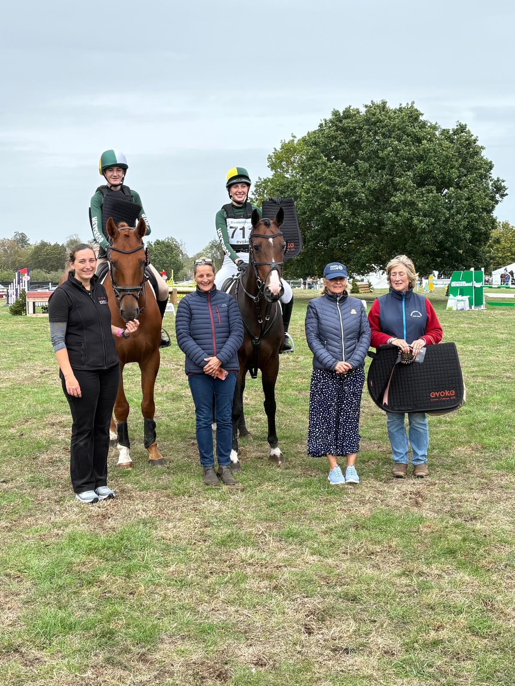

# Charlie Thomas portpholio 
I am currently teaching myself how to code using html and css. So i desided to start of by make a protpholio. The one main warning i will give however before you open the website is that i have dislexia and i havent yet been with outcorrect and proof read it so there will be many grammar mistakes. 

i am the male on the horse winning at blenhiam house horse trial eventrr challenge. 

# My goals with this website 
## learn how to code  
- code using neat code. i will achive this at the end of coding going through and organising it
- tech myself css and html. then after that java
- make a nice looking website. need inprovment.

## Make a porpholio
- i think it is very usful to have portfolio about yourself

## How i made it 
- html & css
- https://www.w3schools.com would highly recomend
- redit 
- stackoverflow

---
# Inprovments 
## inportant ones first 
### add the remaining page 
these pages do not exsit at the momnent so dont try them
- the 'project' page 
-  backing and cooking 
- climbing
- soap and candle making 
- canning
 ### functional 
 - make the footer have a return home button
 - have a back to top button 
 - have a menue that opens
## styles 
- make the photos look nicer 
- make the pages look more seamless
- many more things 
## My product page what will be on it?
### i will put on my project page all of my project i am currently and have aver done they will then link to another page.
#### these are the pages. some will link to exsting page and some will not it really depends on if the project i amd doing as a hobby or as just a project for a certan amount of time. 
- and online shopify store in which i sell hats this will lonk to the th knitting page as the coinside with each other
- a coding page. this will take it to a new page about the coding project i have ever done
- a page for my poems and how i am trying to write 100 poems and publish a book on amaon.
- a page for the kit car in which i made it is a toylander made out of wood which took me 1/2 a year to make so a long long time.
- My a level i get technicly this is not a project but is is taking up the mogority of my time so i will make a page for them 
- a re cane page to link to the origanl recanning page that is already made.m 

### credits
Charlie thomas 

### Ai usage 
Ai did not write any code however i did as it opion on desings i have done and how to do some things however i would then go resurch what it said. 
